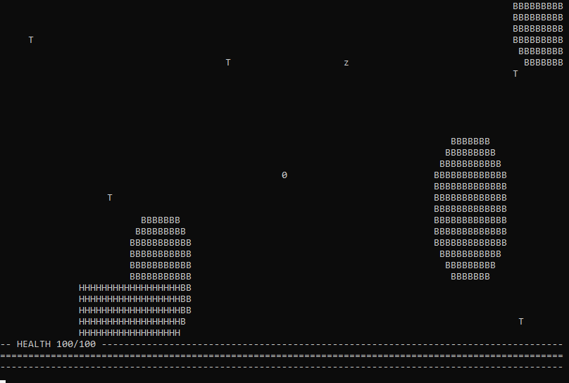

# UPEI SMCSS GameJam 2020

The first-place winning entry for the UPEI SMCSS GameJam 2020. The topic was "Text-based game" with a time limit of 5 hours.

This game, "Sword of Blades", is a simple roguelike with a randomly generated map and endless horde of enemies spawning.

## Notes

* The game was made in C++ without libraries (outside of Windows APIs)
* No attention was spent on code quality, just getting things working
* Porting to other OS's should not be difficult, but was not done here